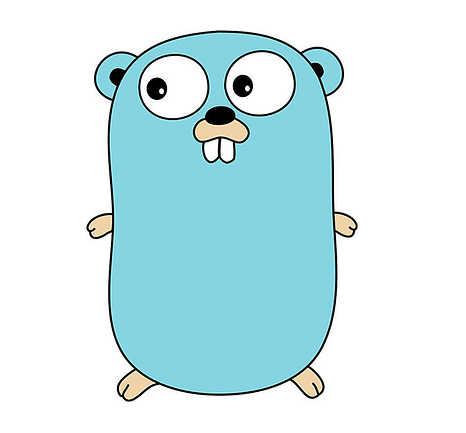

## Hi there, I'm Pierre!

I'm a full-stack developer currently living in London. Most experienced with Javascript technologies but always looking to expand my skillset and learn new tools in my efforts to build useful software.

I'm currently open for work, so feel free to reach out at pierrelejay1@gmail.com or on [LinkedIn](https://www.linkedin.com/in/pierrelejay/)

## Past and current projects

### Current project:

- [Your Family Paediatrician](https://github.com/PLejay/your-family-paediatrician), a landing page for my wife’s paediatrician private service built using Astro and Typescript. I am more used to building interactive web apps than landing pages so this is a good practice in something a bit different!

### Past projects:

- [Explicit TS Exports](https://github.com/PLejay/explicit-ts-exports), a VS Code extension adding a command to quickly generate an index.ts file for a folder of typescript files. Built using the [TypeScript Compiler API](https://github.com/microsoft/TypeScript/wiki/Using-the-Compiler-API)

- [Remedic](https://github.com/alexanderjshall/remedic-app), a full-stack app that provides an in-person patient-doctor consultation across a language-barrier without using a translator. Built in a team of 6 people using React and Tailwind CSS in the front end, GraphQL, Typescript, and Express and PostgreSQL in the back end.

-  [Quizzie](https://github.com/PLejay/quizzie), a web app allowing users to create randomized quizzes based on collections of card-based questions. Solo 1-week project built using React in the front end, Typescript and Express and MongoDB in the back end.

## My language and tools

 
I prefer to use
<code></code>
<code></code>
<code></code>
<code></code>
<code></code>
<code></code>
<code></code>
<code></code>
<code></code>

But am also learning/getting more practice in
<code></code>
<code></code>
<code></code>

 
 
Although my time for doing side projects is limited, I am always taking new courses and trying to expand my knowledge via reading, watching and learning about engineering through various sources. Continuously aiming to  [increase that T-factor.](https://en.wikipedia.org/wiki/T-shaped_skills)
